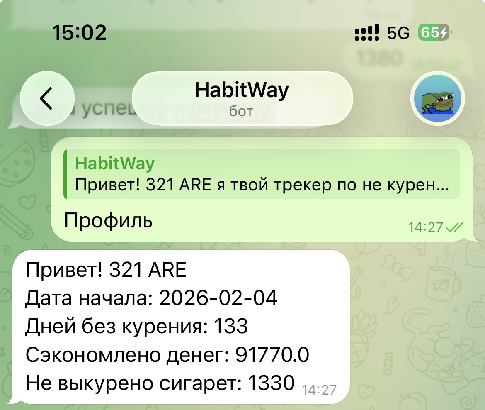
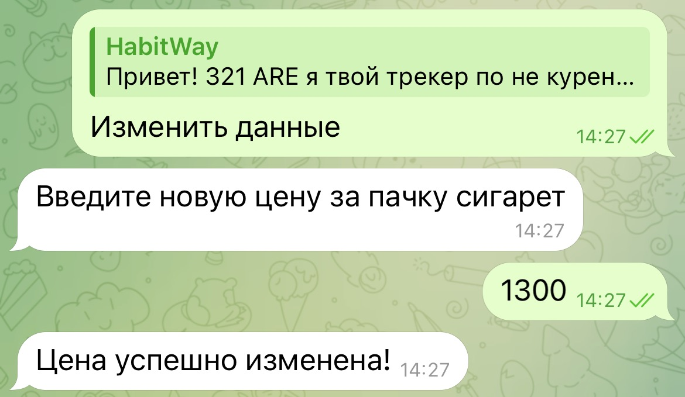

# HabitWay
## My last TG bot for Not Smoking tracker 

## Что делает бот?
```
1. Проверка на аутентифицированного пользователя
2. Отслеживание количества дней без курения
3. Возможность изменить цену за пачку сигарет когда они подорожают
4. Сбрасывание прогресса если пользователь покурил
```

### Structure of project:
```
HabitWay_bot/
├── main.py                  — запуск бота и приветствие
├── config.py                — токен, данные БД
├── database/
│   ├── initializition.py    — подключение к БД
│   └── requests.py          — все SQL запросы
├── handlers/
│   ├── __init__.py          - инициализация хэндлера
│   ├── registration.py      - процесс регистрации
│   ├── profile.py           - показ профиля
│   ├── calculations.py      - функции для подсчета
│   ├── add_changes.py       - внесение изменение в цене за пачку
│   └── reset.py             - сброс прогресса
├── keyboards/
│   ├── exist_keyboard.py    — кнопки для зарегистрированного пользователя
│   └── unexist_keyboard.py  - кнопка для незарегистрированного пользователя
├── states/
│   └── registration.py      - состояние для регистрации
└── middlewares/
    └── middleware.py        — передача соединения БД в handlers
```   
## Structure of Database


## Технологии
```
Python 3.12
Aiogram 3
PostgreSQL
Asyncpg
```

## Профиль:

## Внесение изменений:

## Сброс и кнопки:


## Для чего данный проект?
### Проект максимально базовый для тренировки с PostreSQL и деплоем его в сеть
### Показывает пагубное влияение на кошелек когда пользователь курит и позволяет увидеть средства что сэкономили

## Почему?
### Я сам бросил курить и в приложении средства что я сэкономил показывает только
### за старую цену которую я внёс когда бросил